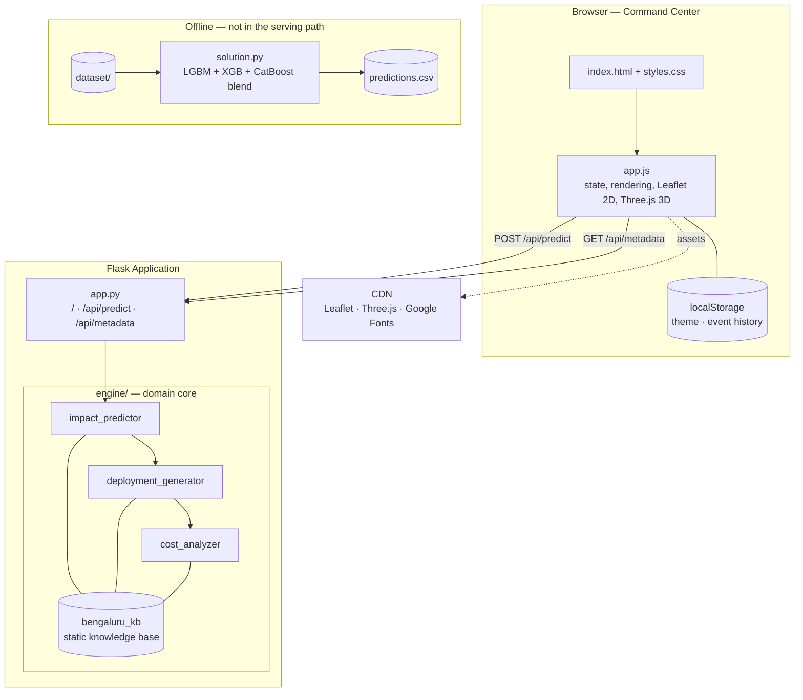
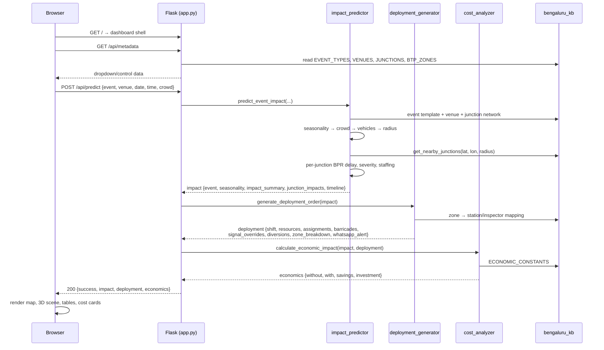
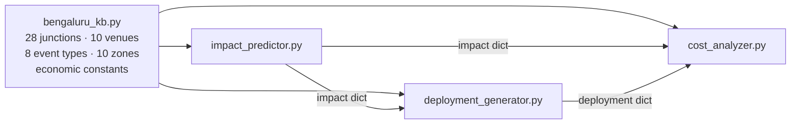
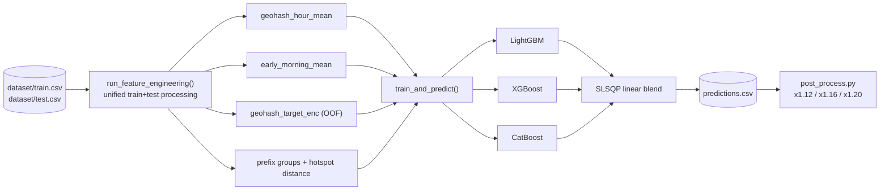

# ASTraM — System Architecture

> Technical design reference for the ASTraM Command Center (Gridlock Hackathon 2.0).
> For features and setup see [README.md](README.md); for planned work see [UPGRADES_AND_ROADMAP.md](UPGRADES_AND_ROADMAP.md).

---

## 1. Design Principles

The system is built around four constraints that shaped every structural decision:

| Principle | Consequence |
|---|---|
| **Deterministic core** | The serving path runs a closed-form traffic model, not an inference call. No model artifacts, no GPU, no warm-up — identical inputs always yield identical orders, which matters when the output is a police deployment instruction that must be auditable. |
| **Stateless request path** | Every prediction is computed from the request body plus a static knowledge base. No database, no session store, no shared mutable state — the app scales horizontally and cold-starts instantly on serverless hosts. |
| **Domain logic isolated from transport** | [`engine/`](engine/) has no Flask import. The pipeline is callable from a script, a notebook, or a test with no HTTP involved. |
| **One request, one complete answer** | A single `POST` returns impact, deployment order, and economics together. The browser never orchestrates multi-step calls, so partial or inconsistent UI states are impossible. |

---

## 2. System Context



**The offline pipeline is deliberately decoupled.** `solution.py` produces competition submissions from
the hackathon dataset; it does not feed the live engine, and the engine does not load `predictions.csv`.
They share a problem domain, not a runtime. See [§8](#8-offline-ml-pipeline) and [§10](#10-known-characteristics--gaps).

---

## 3. Request Lifecycle



Errors are handled at a single boundary: [`app.py`](app.py) wraps the whole pipeline in one
`try/except` and returns `400` with `{"success": false, "error": "..."}`. The engine raises
`ValueError` on an unknown event type; unparseable dates fall back to 18:00 today rather than failing.

---

## 4. Layer Breakdown

### 4.1 Presentation — [`templates/`](templates/), [`static/`](static/)

A single-page dashboard served as one Flask template. No build step, no framework, no bundler —
`app.js` (~2,260 lines) is plain ES5/ES6 loaded directly.

| Concern | Implementation |
|---|---|
| **View switching** | `switchView()` toggles map / 3D / table / economics panes; `activeView` holds the mode |
| **2D mapping** | Leaflet 1.9.4 — `renderMap()` draws venue marker, junction markers coloured by severity, and impact radius circles |
| **3D tactical mode** | Three.js r128 + OrbitControls — `init3DTacticalScene()` composes ~12 builder functions (stadium, roads, crowd swarms, vehicles, constables, barricades, beacons, trees, potholes) into named `THREE.Group`s, driven by `animate3DScene()` |
| **Client state** | Module-level globals — `currentResult`, `previousResult`, `junctionData`, `activeSeverityFilter`, sort column/direction, and the 3D scene handles |
| **Persistence** | `localStorage` only — `btp_theme` and `btp_astram_event_history` (recent predictions, replayable via `loadHistoryEntry()`) |
| **Rendering** | One `render*` function per output section: `renderSummary`, `renderJunctionGrid`, `renderTimeline`, `renderBandobast`, `renderEconomics`, `renderFlipkart`, `renderWhatsApp`, `renderZoneBreakdown` |

Third-party assets load from CDN (`unpkg`, `cdnjs`, `jsdelivr`, Google Fonts), so the page needs
network access beyond the app server itself.

### 4.2 API — [`app.py`](app.py)

Deliberately thin: routing, type coercion, orchestration, error shaping. No domain logic.

| Route | Method | Purpose |
|---|---|---|
| `/` | GET | Renders the dashboard shell |
| `/api/predict` | POST | Runs the three-stage pipeline, returns the combined result |
| `/api/metadata` | GET | Projects the knowledge base into UI-shaped dropdown data |

`/api/metadata` returns a *projection*, not the raw knowledge base — only the fields the UI needs
(name, icon, coordinates, capacity, zone). Internal tuning constants stay server-side.

### 4.3 Domain Engine — [`engine/`](engine/)

Four modules in a strict one-way dependency chain. Nothing imports Flask; nothing writes to disk.



Each stage consumes the previous stage's dictionary — a plain-dict contract rather than a class
hierarchy, so every intermediate result is directly JSON-serialisable and inspectable.

### 4.4 Knowledge Base — [`engine/bengaluru_kb.py`](engine/bengaluru_kb.py)

The static substrate the whole model rests on. Data, not code.

| Structure | Contents |
|---|---|
| `JUNCTIONS` (28) | name, lat, lon, `base_capacity` (vehicles/hr), `typical_constables`, road type, zone |
| `VENUES` (10) | name, coordinates, capacity — plus a `custom` entry for arbitrary lat/lon |
| `EVENT_TYPES` (8) | `peak_crowd_factor`, `vehicle_ratio`, `congestion_multiplier`, `impact_radius_km`, pre/post surge hours, duration, `barricade_type`, `signal_override_needed`, `predictability` |
| `BTP_ZONES` (10) | zone → traffic station + responsible Traffic Inspector |
| `ECONOMIC_CONSTANTS` | fuel cost per idle hour, wage per hour, Flipkart SLA costs, constable/barricade/signage costs, CO₂ per idle vehicle-hour, emergency baseline |

Junctions carry **real road capacity**, so congestion is scored against actual throughput rather
than an abstract index. `get_nearby_junctions()` is the sole spatial query — a Haversine sweep over
all 28 junctions, sorted by distance. At this scale a linear scan is faster than any spatial index.

---

## 5. The Computation Model

The heart of the system. Eight stages, all closed-form.

**① Event & seasonality resolution** — Resolve the event template and venue. Apply calendar logic:
IPL outside April–May scales crowd to `0.35` (domestic-match baseline); June–August applies a
`1.20` monsoon delay multiplier; October/November/January are flagged as festive-baseline months.

**② Crowd → vehicle conversion**
```
crowd            = expected_crowd  OR  venue.capacity x peak_crowd_factor x season_modifier
vehicles         = crowd x vehicle_ratio / 2.5          # 2.5 average occupancy
```

**③ Spatial selection** — The impact radius scales with turnout, then selects junctions:
```
crowd_scale      = clamp(crowd / 20000, 1.0, 2.0)
radius           = event.impact_radius_km x crowd_scale
affected         = get_nearby_junctions(venue.lat, venue.lon, radius)   # Haversine
```

**④ Per-junction load** — Event traffic decays exponentially with distance; 80% of event vehicles
are assumed to route through nearby junctions:
```
decay            = exp(-2.5 x distance / radius)
base_load        = hourly_profile[event_hour]           # 0.05 (03:00) … 1.00 (18:00)
weekend_factor   = 0.75 if weekend else 1.00
normal_vehicles  = base_capacity x base_load x weekend_factor
event_vehicles   = vehicles x decay x 0.80
capacity_ratio   = (normal + event) / base_capacity
```

**⑤ Delay — modified BPR function** — A Bureau of Public Roads volume-delay curve recalibrated for
Indian mixed traffic (`alpha = 0.9`, `beta = 4.5` against the classic 0.15 / 4.0), plus a proximity
surge term, capped at 90 minutes:
```
bpr_delay        = 3.0 x 0.9 x max(0, capacity_ratio^4.5 - 1)
proximity_delay  = congestion_multiplier x decay x 8.0 x monsoon_factor
delay            = min((bpr_delay + proximity_delay) x monsoon_factor, 90)
```

**⑥ Deployment effectiveness** — The counterfactual that makes the whole product argument:
```
effectiveness    = 0.20 (signal override, if applicable)
                 + min(0.25, decay x 0.30)   (constable presence)
                 + 0.15 (diversion routes)
                 → capped at 0.60
delay_with       = delay x (1 - effectiveness)
```

**⑦ Severity & staffing** — A blended score drives the four-level classification and the extra
constables requested per junction:
```
score            = capacity_ratio x 0.4 + (delay / 15) x 0.6
CRITICAL score > 1.8 or ratio > 1.8   → max(4, 6 x decay) extra constables
HIGH     score > 1.2 or ratio > 1.4   → max(2, 4 x decay)
MODERATE score > 0.6 or ratio > 1.0   → max(1, 2 x decay)
LOW      otherwise                    → 0
```
Junctions are then sorted CRITICAL-first, then by proximity.

**⑧ Timeline** — An hourly series across four phases — *Normal → Pre-Event Surge → Event Active →
Post-Event Dispersal → Normal* — with the load factor ramping linearly `0.3 → 1.0` into the event
and decaying `1.0 → 0.3` afterwards.

### 5.1 Order Generation

[`deployment_generator.py`](engine/deployment_generator.py) turns the impact model into an
operational document:

- **Order reference** — `BTP/SPECIAL/YYYYMMDD/<EVENT>` for field traceability
- **Shift window** — `event − (pre_surge + 0.5h)` to `event + duration + post_surge + 0.5h`
- **Assignment filter** — LOW-severity junctions needing no extra staff are dropped, so the order lists only actionable posts
- **Escalating instructions** — CRITICAL gets manual regulation + barricades + a 30s green extension; HIGH gets active management + 15s; MODERATE gets monitor-and-redirect
- **Zone rollup** — assignments grouped by BTP division with the responsible station and Traffic Inspector attached
- **WhatsApp brief** — the same order compressed into a low-bandwidth text message for constables in the field

### 5.2 Economic Model

[`cost_analyzer.py`](engine/cost_analyzer.py) prices two scenarios and their difference:

```
Cost(scenario)   = fuel_waste + productivity_loss + flipkart_SLA_cost
deployment_cost  = extra_constables x (shift_hours / 8) x 1800
                 + barricades x 2500
                 + diversion_routes x 800
net_savings      = cost_without − (cost_with + deployment_cost)
ROI %            = net_savings / max(deployment_cost, 1) x 100
```

Also tracked, but excluded from the headline cost: emergency-response degradation (baseline 8 min,
plus 40% of average delay without deployment vs. 20% with) and CO₂ from idling vehicles at
2.3 kg per vehicle-hour.

---

## 6. Data Contracts

The three stage outputs are the system's real interfaces — the browser, the API, and every module
agree on these shapes.

```jsonc
impact = {
  "event":           { type, type_name, icon, venue, venue_lat, venue_lon, date, time,
                       day_name, is_weekend, expected_crowd, vehicles_generated,
                       duration_hours, impact_radius_km, predictability,
                       barricade_type, signal_override_needed },
  "seasonality":     { month_name, month_num, is_official_season,
                       seasonal_crowd_modifier, monsoon_factor, notes[] },
  "impact_summary":  { affected_junctions, critical_junctions, high_junctions,
                       avg_delay_without_deployment_min, avg_delay_with_deployment_min,
                       delay_reduction_pct, total_delayed_vehicles,
                       total_delay_person_hours, total_extra_constables,
                       impact_window_start, impact_window_end },
  "junction_impacts":[{ junction_id, name, lat, lon, zone, distance_km,
                        normal_vehicles_hr, event_vehicles_hr, total_vehicles_hr,
                        capacity, capacity_ratio, congestion_multiplier,
                        delay_without_deployment_min, delay_with_deployment_min,
                        severity, color, typical_constables,
                        extra_constables_needed, total_constables,
                        road_type, impact_decay }],
  "timeline":        [{ time, phase, load_factor, congestion_level }]
}

deployment = { order_reference, generated_at, event, shift, resources, assignments,
               barricade_locations, signal_overrides, diversions,
               zone_breakdown, whatsapp_alert }

economics  = {
  "without_deployment":    { fuel_waste, productivity_loss, flipkart_delivery_cost, total_cost,
                             delayed_vehicles, person_hours_lost, deliveries_delayed,
                             emergency_response_min, co2_emissions_kg, deployment_cost },
  "with_deployment":       { ...same shape, deployment_cost populated },
  "savings":               { net_savings, net_savings_lakhs, roi_percentage, fuel_saved,
                             productivity_recovered, flipkart_deliveries_saved,
                             person_hours_recovered, emergency_response_improvement_min,
                             co2_reduced_kg },
  "deployment_investment": { constable_cost, barricade_cost, signage_cost, total_investment }
}
```

`severity` carries its own `color`, so the palette is defined once server-side and reused by the
Leaflet markers, the 3D beacons, and the impact table without duplication in JS.

---

## 7. Deployment Topology

```
Browser ──HTTPS──> Flask app (app.py)
                     ├── templates/ + static/   (served directly)
                     └── engine/                (in-process, no I/O)
Browser ──HTTPS──> CDN (Leaflet, Three.js, Google Fonts)
```

Single process, no external services, no persistence. Port comes from `PORT` (default `5000`).
Because the engine holds no state between requests, any number of instances can run behind a load
balancer with no coordination.

---

## 8. Offline ML Pipeline

[`solution.py`](solution.py) is a separate architecture with its own lifecycle:



Three architectural notes:

- **Unified train/test feature engineering** — both frames are processed together so categorical
  encodings and binning edges cannot drift apart between fit and inference.
- **Lazy booster imports** — each of the three engines is imported inside its training block and
  skipped if unavailable, so the pipeline degrades to whichever libraries are installed rather than
  failing at import time. The blend weights adapt to whichever engines actually ran.
- **Leak-controlled target encoding** — `geohash_target_enc` is computed out-of-fold under the same
  5-fold split (`random_state=42`) used for training.

---

## 9. Extension Points

| To add… | Touch |
|---|---|
| A new event type | `EVENT_TYPES` in `bengaluru_kb.py` — the pipeline, UI dropdowns, and orders pick it up automatically |
| A new junction or venue | `JUNCTIONS` / `VENUES` — spatial selection and zone rollups adapt with no code change |
| Different economics | `ECONOMIC_CONSTANTS` — the cost model reads every figure from this one dict |
| A new output section | One `render*()` in `app.js` plus a key in the relevant stage's return dict |
| A new pipeline stage | A module in `engine/`, chained in `app.py` after `cost_analyzer` |

The knowledge base is intentionally the widest extension surface: most realistic changes are data
edits, not code edits.

---

## 10. Known Characteristics & Gaps

Documented deliberately — these are the honest edges of a hackathon prototype.

| Item | Detail |
|---|---|
| **Monsoon factor compounds** | In `impact_predictor.py`, `proximity_delay` already includes `monsoon_factor`, and the sum is multiplied by it again — so the proximity term scales by `1.44x`, not `1.20x`, in June–August. Intentional or not, it should be a conscious choice. |
| **No deploy configuration in-repo** | The README links a Vercel deployment, but there is no `vercel.json`, `Procfile`, or `Dockerfile` tracked. The hosted build is not reproducible from this repository alone. |
| **`debug=True` is hardcoded** | `app.run(debug=True, ...)` ships the Werkzeug debugger. Fine locally; it must not reach a public host. |
| **No persistence layer** | Prediction history lives in browser `localStorage` only — per-device, clearable, invisible to the server. Nothing is auditable after the fact. |
| **No authentication** | `/api/predict` is open. Acceptable for a demo; a real BTP deployment needs authenticated, role-scoped access. |
| **No automated tests** | The engine is pure and dictionary-in/dictionary-out — close to ideal for unit testing — but no suite exists yet. |
| **ML pipeline is decoupled** | `predictions.csv` never reaches the serving engine. Wiring forecast demand into `impact_predictor` as a baseline load (replacing the static hourly profile) is the most significant available architectural upgrade. |
| **Client state is global** | `app.js` keeps state in module-level globals. Workable at this size; the 3D scene handles in particular would benefit from encapsulation before the file grows further. |
| **CDN dependency** | Leaflet, Three.js, and fonts load from third-party CDNs — the dashboard degrades without public network access. |

---

## 11. Model Calibration Reference

Every tunable constant in the serving path, in one place.

| Constant | Value | Location |
|---|---|---|
| Distance decay coefficient | `2.5` (exponential) | `_time_decay_factor` |
| Average vehicle occupancy | `2.5` persons | `impact_predictor` |
| Event traffic through nearby junctions | `80%` | `impact_predictor` |
| BPR free-flow crossing time | `3.0` min | `impact_predictor` |
| BPR alpha / beta | `0.9` / `4.5` | `impact_predictor` |
| Delay cap | `90` min | `impact_predictor` |
| Weekend baseline factor | `0.75` | `impact_predictor` |
| Impact radius crowd scaling | `1.0x – 2.0x` (per 20,000 attendees) | `impact_predictor` |
| IPL off-season scaling | `0.35` | `impact_predictor` |
| Monsoon delay multiplier | `1.20` (June–August) | `impact_predictor` |
| Max deployment effectiveness | `60%` | `impact_predictor` |
| Shift buffer either side | `0.5` h | `deployment_generator` |
| Signal green extension | `+30s` CRITICAL / `+15s` HIGH | `deployment_generator` |
| Economic constants | see `ECONOMIC_CONSTANTS` | `bengaluru_kb` |
