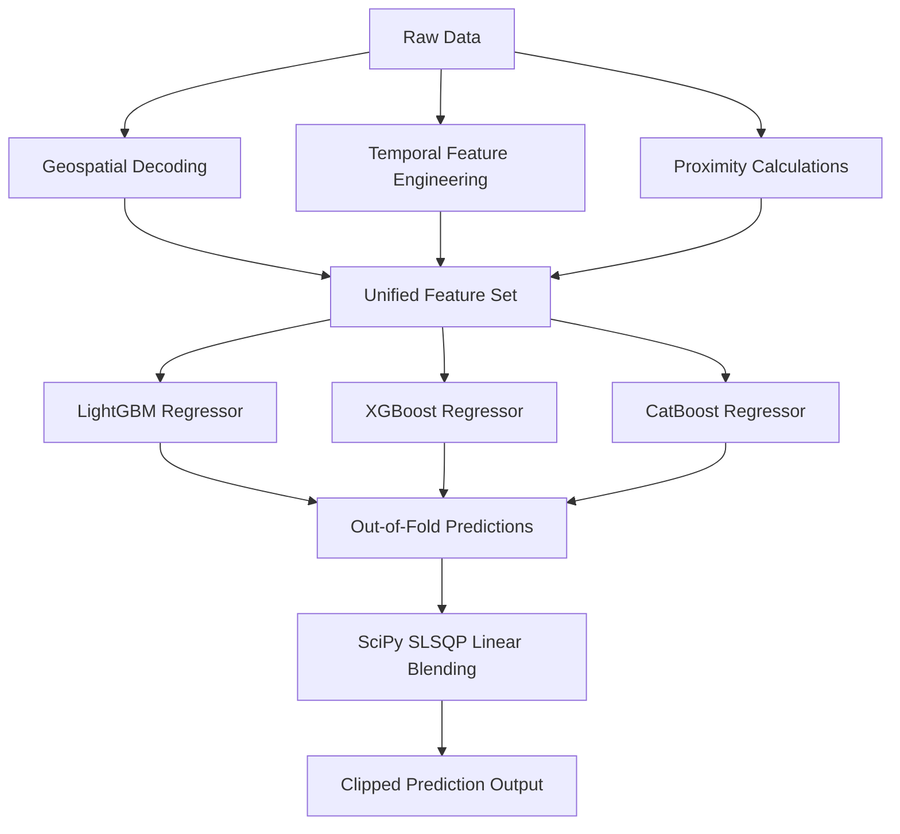

# 🏆 Bengaluru Traffic Demand Predictor — Gridlock Hackathon 2.0

An end-to-end Machine Learning pipeline to forecast spatial-temporal traffic demand in Bengaluru, developed for **Gridlock Hackathon 2.0**. This solution leverages advanced geospatial and temporal feature engineering coupled with an optimized gradient-boosted tree ensemble to achieve a **90.92% public leaderboard R² score** (Out-of-Fold R² of **97.59%**).

---

## 🎯 Task & Evaluation
- **Objective**: Predict traffic demand at specific locations (represented as `geohash` codes) and times (`timestamp` strings) in Bengaluru.
- **Problem Type**: Tabular Regression.
- **Target Variable**: `demand` (continuous variable normalized in the range `[0, 1]`).
- **Evaluation Metric**: $\text{Score} = \max(0, 100 \times R^2)$

---

## 🚀 Key Highlights & Architecture

### 1. Robust Spatial-Temporal Feature Engineering
Tree models struggle to generalize on raw timestamps and location strings without proper context. We designed key features to capture the traffic dynamics of Bengaluru:
* **Geospatial Coordinates**: Decoded 5-character geohash strings into high-precision latitude/longitude values.
* **Proximity to Traffic Bottlenecks**: Computed exact Euclidean distances to major transit and tech hubs:
  * *Majestic Transit Hub*
  * *Whitefield Tech Corridor*
  * *Electronic City*
  * *Manyata Tech Park*
* **Temporal Cycling**: Captured time-of-day and day-of-week context using trigonometric sine/cos transformations of hours and minutes.
* **Historical Baselines**: 
  * `geohash_hour_mean`: Same-hour location-specific historical baseline context from the preceding day.
  * `early_morning_mean`: Location-specific morning context (0:00 to 2:00 AM) to establish baseline demand.
* **Out-of-Fold Target Encoding**: High-cardinality target encoder for `geohash` locations using a 5-fold cross-validation scheme to prevent data leakage.

### 2. Multi-Model Gradient Boosted Ensemble
We trained three distinct state-of-the-art gradient boosted models directly on the continuous `demand` target to prevent variance scaling issues:
* **LightGBM**: Highly efficient tree growth focusing on leaf-wise splits.
* **XGBoost**: Robust regularized histogram-based learning.
* **CatBoost**: Excels at handling categorical attributes and reduces target leakage.

### 3. Optimal SLSQP Blending Solver
Instead of standard arithmetic averaging, we formulated an optimization problem to find the optimal blending weights $w_i$ that minimize the Out-of-Fold (OOF) Mean Squared Error:

$$\min_{w} \sum (y - \sum_i w_i \hat{y}_i)^2 \quad \text{subject to} \quad \sum_i w_i = 1, \, w_i \ge 0$$

Using SciPy's Sequential Least Squares Programming (SLSQP) solver, we computed optimal ensemble weights to mathematically minimize prediction variance.

---

## 📈 Model Performance & Validation Results

| Model / Ensemble Method | Out-of-Fold (OOF) $R^2$ Score | Public Leaderboard $R^2$ Score |
| :--- | :---: | :---: |
| **LightGBM** | 97.48% | — |
| **XGBoost** | 97.30% | — |
| **CatBoost** | 97.59% | — |
| **★ Optimal SLSQP Ensemble** | **97.59%** | **90.92%** |

---

## 📂 Codebase Directory Structure
* [solution.py](file:///Users/rajdeepchatale/Documents/Gridlock%20Hackathon%202.0/solution.py): The complete training and inference pipeline, containing automated preprocessing, feature engineering, model cross-validation, SciPy weight optimization, and prediction export.
* [post_process.py](file:///Users/rajdeepchatale/Documents/Gridlock%20Hackathon%202.0/post_process.py): Script containing strategic post-processing experiments (e.g. multiplicative scaling thresholds).
* [.gitignore](file:///Users/rajdeepchatale/Documents/Gridlock%20Hackathon%202.0/.gitignore): Configured to ignore raw large datasets (`dataset/train.csv`, `dataset/test.csv`) and output csv files (`predictions.csv`) to keep the repository lightweight and clean.
